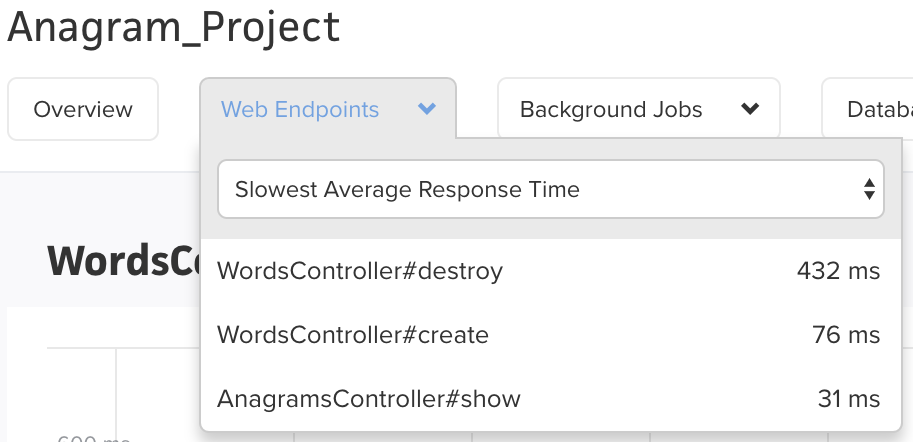

# Anagram  
---

Anagram is a Rails based back end API, made to store words and track anagrams.  Words can be added or deleted from the data store, and then queried against in order to find anagrams for a specified input.  The application utilizes a PostgreSQL database with a Redis memory cache for faster queries, and also utilizes a daily scheduled task on the production site in order to remove childless entries, scheduled for 2 AM (MDT/MST).  ScoutApp was used for production benchmarking.

## Production Site  
---
[https://anagramfinder35.herokuapp.com](https://anagramfinder35.herokuapp.com)  
*Partial word database due to Heroku limit (~5k unique words).

## Project Management 
---
[https://trello.com/b/JgkPHYfK/anagram](https://trello.com/b/JgkPHYfK/anagram)

## API Endpoints
---  

### Add Words  

Takes a JSON array of English-language words and adds them to the data store.

* **URL**

    /words.json

* **Method:**

    `POST`
  
*  **URL Params**

	  None

* **Data Params**

    **Required:** `{"words": ["wordone", "wordtwo", "wordthree"] }`

* **Success Response:**

  * **Code:** 201  
  * **Content:** None
 
* **Sample Call:**

    ```
    $ curl -i -X POST -d '{ "words": ["field", "table", "cup"] }' http://localhost:3000/words.json
    ```  

### Find Anagrams  

Returns a JSON array of English-language words that are anagrams of the word passed in the URL.

* **URL**

    /anagrams/**:word**.json

* **Method:**

    `GET`
  
*  **URL Params**

	  **Required:** Replace **:word** with your desired word.  
	  **Optional:** `limit=[integer]` Set to limit number of return anagrams.  

* **Data Params**

    None

* **Success Response:**

  * **Code:** 200  
  * **Content:**  `{"anagrams": ["wordone", "wordtwo"]}`
 
* **Sample Call:**

    ```
    $ curl -i http://localhost:3000/anagrams/read.json?limit=2
    ```  

### Delete a Word  

Deletes a single word from the data store.

* **URL**

	/words/**:word**.json

* **Method:**

    `DELETE`
  
*  **URL Params**

	  **Required:** Replace **:word** with your desired word.

* **Data Params**

	  None

* **Success Response:**

  * **Code:** 204  
  * **Content:**  No Content
 
* **Sample Call:**

    ```
    $ curl -i -X DELETE http://localhost:3000/words/read.json
    ```  

### Delete All Data  

Deletes all contents of the data store.

* **URL**

	/words.json

* **Method:**

    `DELETE`
  
*  **URL Params**

	  None

* **Data Params**

	  None

* **Success Response:**

  * **Code:** 204  
  * **Content:**  No Content
 
* **Sample Call:**

    ```
    $ curl -i -X DELETE http://localhost:3000/words.json
    ```

## Getting Started Locally  
---

These instructions will get you a copy of the project up and running on your local machine for development and testing purposes.  

### Prerequisites  

This application was created in Rails v5.1.6, utilizing Ruby v2.4.1. 

### Installing  

Clone the project down locally to your machine.  
```
git clone https://jplynch35@bitbucket.org/jplynch35/anagram.git
```  
Inside the project directory, prepare the gems for development with bundler.  
```
bundle install
``` 
Create the database and run the migrations.
```
rake db:{create,migrate}
``` 

## Importing Words from Supplied List  
---

Inside the project directory, run the following rake command. The list is rather large and will take some time to complete importing.  A progress bar has been added, allowing you to monitor progress.
```
rake import:txt
```

## Running a Local Server 
---

Inside the project directory, start a local application server.
```
rails s
``` 
In a separate terminal console within the project directory, start a local Redis server.
```
redis-server
``` 

## Running Tests  
---

This application has two separate test suits.  One is ran internally within the project, utilizing RSpec.  The second is ran externally on a running localhost:3000.

### Internal
In order to run the internal test suite, call upon RSpec in the terminal while in the application folder.  
```
rspec
```

### External
In order to run the external test suite, you must first run the server for this application locally (refer above to Running a Local Server).

Open the test application, **platform_dev**, and remove all the pending lines from tests.  From within the platform_dev application folder, run the test file.
```
ruby anagram_test.rb
```

## Design Overview  
---  
* Project Planning:
	* I chose to create a Rails based application as I felt I could personally create the best app with a Rails framework, putting my best foot forward.
	* I decided to utilize a PostgreSQL database over just using memory as I had scability and data persistence in mind, in addition I knew my schema would require a relational database.
	* I also knew I potentially wanted to utilize a memory cache in order to allow the app to perform faster, and chose to incorporate Redis to accomplish this.
	* Beginning with a [Trello](https://trello.com/b/JgkPHYfK/anagram) board, I started to track requirements and progress.
* Schema:
	* I started to research the best way to save anagrams.  I came to the conclusion that I would benefit from sorting the spelling of each word alphabetically when the word came into the application.  I then thought about having a Word object with sorted spelling and spelling attributes, but this would repeat data.  From this initial idea, I wanted to normalize the database.
	* I decided to have two separate objects, Anagrams and Words.  The Anagram would hold the sorted spelling attribute and have many Word objects associated with it that simply contained the spelling attribute (and the Anagram id).  This way, data would not be repeated in the database.
		* { width=30% }
	* Anagrams and Words would also fit the expected paths and create a RESTful application design.
* Set Up:
	* I chose BitBucket as private repositories were included on the free plan.
	* I utilized a development and master branch workflow, with the idea that I would push into development multiple times a day and then push into master less frequently.
	* BitBucket uses an internal CI called Pipeline.  I set up Pipeline to run the internal RSpec tests every time a branch was merged.  I also had it auto-deploy the code to the Heroku production site whenever development was merged into master.
		* Pipeline had to be turned off after the application was fully functional and before refactoring as I was running out of Pipeline time on the free plan.
		* Pipeline was turned back on for the final code push.
* Initial Coding:
	* I followed a TDD approach with RSpec to creating the application.  I looked at the requirements and the external test suite to drive each feature of the app.
	* I created each feature and had a fully functioning application.  It passed the local and external test suites, but I knew it needed refactoring.
	* I used Heroku for a production site, but had issues with database limits (free plan caps at 10k rows).  I created a separate dictionary file and rake task to load into Heroku with approximately 5k words.
* Initial Refactoring
	* Refactoring logic out of the controllers and into creators, presenters, and services led to lean controllers.
	* Each PORO was made with a designated purpose in mind.
	* A common letter sorting method was heavily used across the application, so I made this a module to import into each required file.
* Initial Performance Testing
	*  I initially utilized NewRelic for performance testing, but did not enjoy the experience.  After talking with some developers, I decided to use a free trial for ScoutApp.
	*  I discovered that my Word delete and Word create actions were taking a considerable while.
	*  { width=30% }
* Second Refactoring:
	* Word delete:
		* I initially had a callback completed on every Word delete in order to automatically delete Anagram objects if their last associated child Word object was deleted.  I decided to take this out to reduce database calls and instead replace it with a Heroku scheduled production rake task that would remove all childless Anagrams at 2 AM (MDT/MST).  This would speed up app response time and shift that cleanup process to a time when the application would probably be less busy.
	* Word create:
		* Initially Word create had a find_or_create_by for Anagrams and a find_or_create_by for Words.  This produced a lot of database calls.  I decided to change this by giving the Word objects an attribute uniqueness validation for spelling.  This ensured Words would not be duplicated and I simply called upon create rather than find_or_create_by.
	* Redis memory cache
		* Redis allows information to be stored in memory, which has a much faster lookup time compared to a database lookup on PostgreSQL.
		* I have it configured to add anagram get request results to the cache after the first database lookup.  Subsequent calls for anagrams with the same set of letters will pull from the cache rather than hitting the database.
		* Stale data:
			* This presented the problem of presenting stale data to the user.  I had the time expiration time in Redis set for 1 hour, but that means after the anagram list is cached, any changes made to that set of words in the database won't be reflected for 1 hour.
			* To fix this I created a cache busting method.
				* Every word creation or word deletion would bust the cache for that anagram stored in Redis.  Upon this change, the stale data would no longer be pulled and instead the application would know to pull from the PostgreSQL database.
* Second Performance Testing
	* After the second refactoring I re-ran the same requests as the initial performance test.
	* { width=30% }

## Authors  
---  

* [JP Lynch](https://github.com/JPLynch35)
